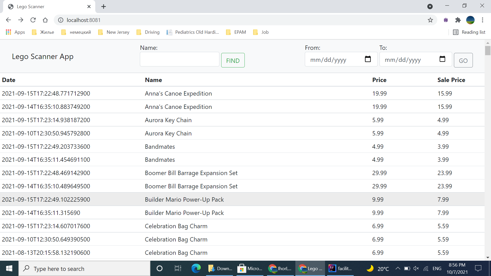

# Facilitation
Someday this project might grow in multiple-modules project. However, for there is only
one idea under development is **Lego Scanner**.

# Lego Scanner

It will open Lego.com and will store all propositions on **Sales** page into in-memory Apache.Derby database.
It should be run on daily basis to collect data and keep it and analyze from historical perspective just ti see if there were any 
changes in prices or to see any new propositions appeared.

The scanning part done via Selenium and Web App is done via Spring-Boot-Web

# How to build

> gradlew :lego-scanner:build

# How to launch the scanner

Navigate Run > Edit Configuration and select 'LegoScannerApp' configuration. 

# How to launch the Web App

Navigate Run > Edit Configuration and select 'LegoScannerWebApp' configuration.

# API documentation

This project has Swagger 2. Navigate to http://localhost:8081/swagger-ui.html to see API's documentation.